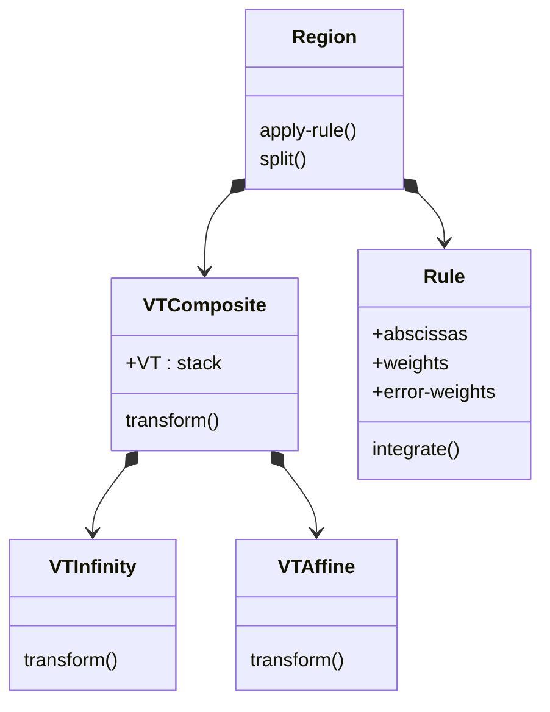

# Functional ranges

## Motivation

Functional ranges definitely expand the integrals covered by "Math::NIntegrate" and (many) numerical integrator 
applications would rely on them.

*TBF...*

## Constant vs functional ranges

The "Math::NIntegrate" framework uses the [Composite Design Pattern](https://en.wikipedia.org/wiki/Composite_pattern)
for the variable transformations of region. [...]

All the constant ranges can be transformed at each variable transformator. 
I.e. each transformer of `stack` is transforms all constant ranges.

For functional boundaries we cannot go level-by-level as with the constant boundaries.
We have to transform each coordinate fully first before computing the transformations of next one. 

