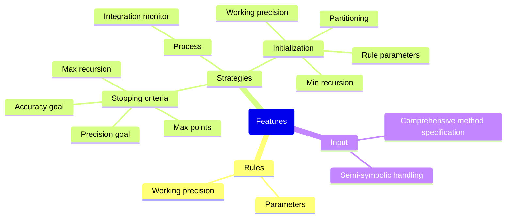

## Framework features 

From end-user point of view the framework has the following features:

```mermaid
mindmap
    root(Features)
        Rules
            Parameters
            Working precision
        Strategies
            Initialization
                Min recursion
                Partitioning
                Rule parameters
                Working precision
            Stopping criteria
                Precision goal  
                Accuracy goal
                Max recursion
                Max points
            Process
                Integration monitor
        Input
            Comprehensive method specification
            Semi-symbolic handling
```