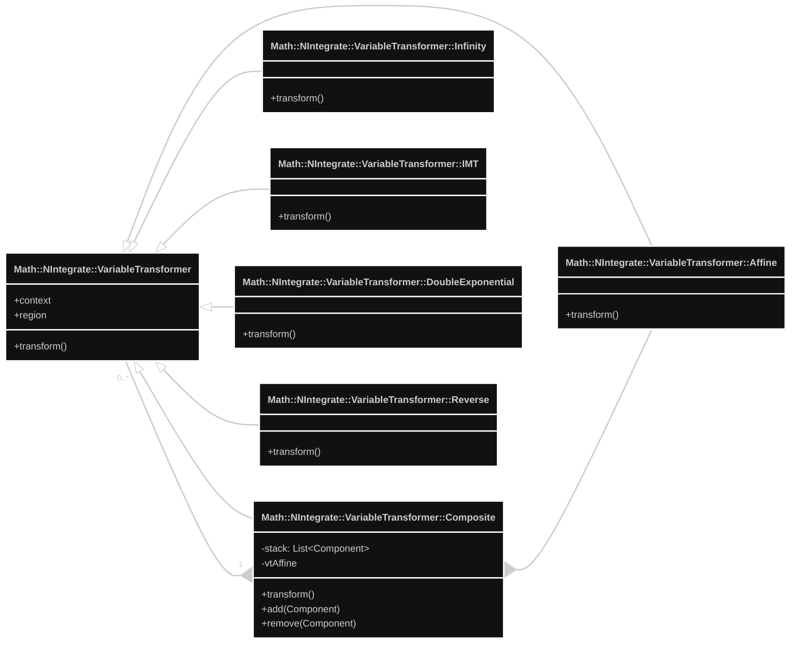

# Methodology and Design 

...for the Raku package "Math::NIntegrate"

---

## Introduction

The Raku numerical integration framework "Math::NIntegrate", [AAp1], is based on Object-Oriented Programming (OOP) design and implementation.
[Design Patterns (by GoF)](https://en.wikipedia.org/wiki/Design_Patterns) are extensively used.

This document outlines the OOP architecture and gives rationale for some of the less obvious design decisions.

---

## Dictionary

- **Integration Region (IReg)** : integration region (or simplex) with boundaries.
- **Integration Rule (IRule)** : integration rule with three lists: abscissas, weights, and error weights.
- **Integration Strategy (IS)** : integration strategies manage sets of integration regions in order to compute integral estimates according to certain precision goals or performance specs. 
- **Singularity Handler (SH)** : singularity handlers are applied when interation strategies do not converge fast enough.
- **Variable Transformer (VT)** : variable transformer object use formulas to map one domain to another.
- **IntegrationMonitor (IM)** : a function that (if specified) is called after every step of an integration strategy. 

---

## Overall process

Each integration strategy of "Math::NIntegrate" creates and manipulates a collection of integration regions. 
Each integration region can have its own integrand and/or integration rule. 
"Math::NIntegrate"'s main integration strategy "GlobalAdaptive" keeps the integration regions in a heap according to their error. 
The sum of the integral estimates of all regions make the global integral estimate. 
The sum of the integral errors make the global error. 
If the global error is larger than the desired tolerance "GlobalAdaptive" splits the region with the largest error estimate into two regions and applies the integration rule. 
If too many splittings have been done then a singularity handler is applied over the last region split.

At each step of an integration strategy the option "IntegrationMonitor" obtains as an argument the list of integration regions used in that step. 
Below is a table that shows methods that can be applied to each integration region in that list.

| Property               | Description                                                                                                          |
|------------------------|----------------------------------------------------------------------------------------------------------------------|
| `"Axis"`               | Returns the axis with maximum error.                                                                                 |
| `"Boundaries"`         | Returns the boundaries of the region.                                                                                |
| `"Dimension"`          | Returns the dimension of the region.                                                                                 |
| `"Error"`              | Returns the error estimate of the last integral estimation.                                                          |
| `"GetRule"`            | Returns the attached integration rule.                                                                               |
| `"GetSamplingPoints"`  | Returns the sampling points used for the integration estimation.                                                     |
| `"GetValues"`          | Returns the integrand values over the sampling points used for the integration estimation.                           |
| `"Integral"`           | Returns the integral estimate of the last integral estimation.                                                       |
| `"Integrand"`          | Returns the integrand (numerical function) attached to the region.                                                   |
| `"NumericalFunction"`  | Returns the integrand (numerical function) attached to the region.                                                   |
| `"OriginalBoundaries"` | Returns the original boundaries of the region (when singularity handling is applied it differs from `"Boundaries"`). |
| `"Properties"`         | Returns all methods applicable.                                                                                      |
| `"WorkingPrecision"`   | Returns the precision with which the function `N` is used during evaluation.                                         |

---

# Integration rule object

The Integration Rule (IRule) object has these three lists:

- Abscissas
- Weights
- Error weights

An IRule is attached to one or more Integration Region (IReg) objects.

IRule's method `integrate` uses the Integration Region (IReg) object method `eval-integrand`.

---

## Integration region object

As mentioned in the previous section, the Integration Region (IReg) objects have a central role in the framework.
IReg objects are instances of the class `Math::NIntegrate::Region`. Every IR has an Integration Rule (IRule) object and 
a Variable Transformer (VT) object. 

For a given IReg object, `R`:

- Its IRule object `R.rule` has a reference to `R` and uses the `R` method `R.eval-integrand` to do rule computations
- Its VT object `R.variable-transformer` has a reference to `R` and uses `R` boundaries.

---

## Variable transformer

The Variable Transformer (VT) hierarchy of classes implements the [Composite design pattern](https://en.wikipedia.org/wiki/Composite_pattern).

The fundamental classes `Math::NIntegrate::Infinity` and `Math::NIntegrate::Affine`. 
Some singularity handlers are implemented VT classes. Some integration rules must be paired with corresponding variable transformers.

An Integration Region (IReg) object would most likely have a `Math::NItegrate::VariableTransformer::Composite` as a VT.
Every VT Composite (VTC) has an `Math::NItegrate::VariableTransformer::Affine` VT. Also, by default, the first VT object 
in VTC's stack is a `Math::NItegrate::VariableTransformer::Infinity` object (VTInf). The reasons for this are:

- VTInf is a must when at least one of the integration ranges is infinite
- VTInf is very fast on finite ranges
- Hence, no performance penalty VTInf being always present in VTC (as the first VT)

---

## Builder

For Builder design pattern is used for the creation of an (operational) integration strategy object.

**Remark:** The Abstract Factory patterns was also considered, by since integration strategy object is derived from 
method specs Builder was chosen since gives more control over the building steps.

---

## References

### Articles, blog posts

[AAmse1] Anton Antonov,
["Determining which rule NIntegrate selects automatically", answer](https://mathematica.stackexchange.com/a/96663),
(2015)
[MathematicaStackExchange](https://mathematica.stackexchange.com).

[AA1] Anton Antonov,
["Adaptive numerical Lebesgue integration by set measure estimates"](https://mathematicaforprediction.wordpress.com/2016/07/01/adaptive-numerical-lebesgue-integration-by-set-measure-estimates/),
(2026),
[MathematicaForPrediction at WordPress](https://mathematicaforprediction.wordpress.com).

### Wolfram Language documentation

### Raku packages

[AAp1] Anton Antonov,
[Math::NIntegrate, Raku package](https://github.com/antononcube/Raku-Data-NIntegrate),
(2021-2026),
[GitHub/antononcube](https://github.com/antononcube).

[AAp1] Anton Antonov, 
[Data::Transformers, Raku package](https://github.com/antononcube/Raku-Data-Transformers),
(2026),
[GitHub/antononcube](https://github.com/antononcube).

[AAp2] Anton Antonov,
[LeftistHeap, Raku package](https://github.com/antononcube/Raku-LeftistHeap),
(2026),
[GitHub/antononcube](https://github.com/antononcube).

### Repositories

[AAr1] Anton Antonov,
["NIntegrate, the missing manual"](https://github.com/antononcube/NIntegrateTheMissingManual-book),
(2019-2026),
[GitHub/antononcube](https://github.com/antononcube).