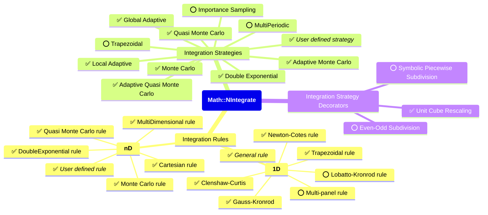

```mermaid
mindmap
  root(**Math::NIntegrate**)
    Integration Rules
      ✅ _General rule_
      **1D**
        ✅ Clenshaw-Curtis
        ✅ Gauss-Kronrod
        ⭕️ Lobatto-Kronrod rule
        ✅ Newton-Cotes rule
        ✅ Trapezoidal rule
        ⭕️ Multi-panel rule
      **nD**
        ✅ Cartesian rule
        ✅ MultiDimensional rule
        ✅ DoubleExponential rule
        ✅ Monte Carlo rule
        ✅ Quasi Monte Carlo rule
        ✅ _User defined rule_

    Integration Strategies
      ✅ Global Adaptive
      ✅ Local Adaptive
      ⭕️ Trapezoidal
      ✅ Double Exponential
      ✅ Monte Carlo
      ✅ Quasi Monte Carlo
      ✅ Adaptive Monte Carlo
      ✅ Adaptive Quasi Monte Carlo
      ⭕️ MultiPeriodic
      ⭕️ Importance Sampling
      ✅ _User defined strategy_

    Integration Strategy Decorators
      ✅ Unit Cube Rescaling
      ⭕️ Even-Odd Subdivision
      ⭕️ Symbolic Piecewise Subdivision
```